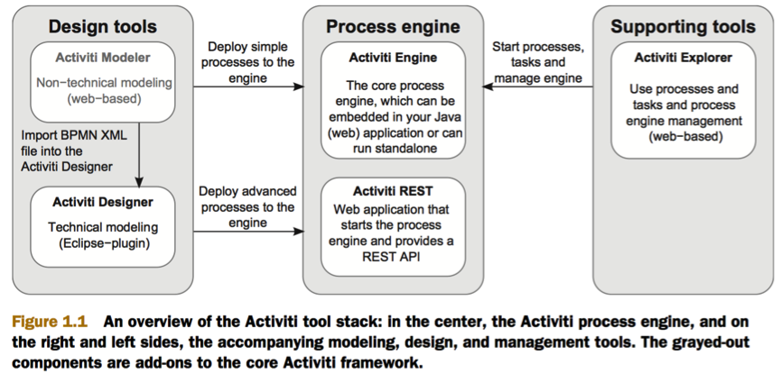
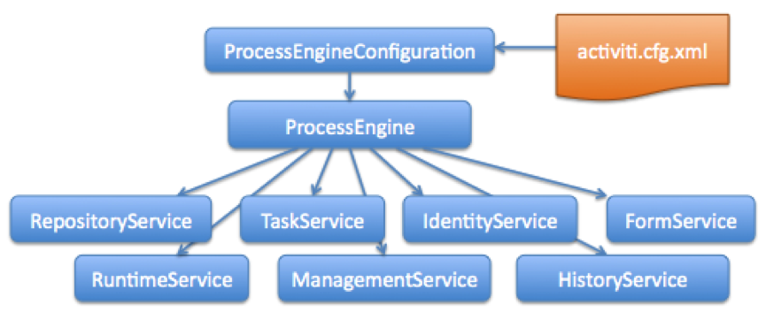
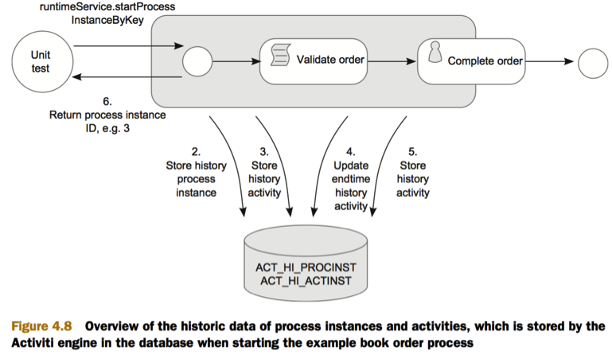
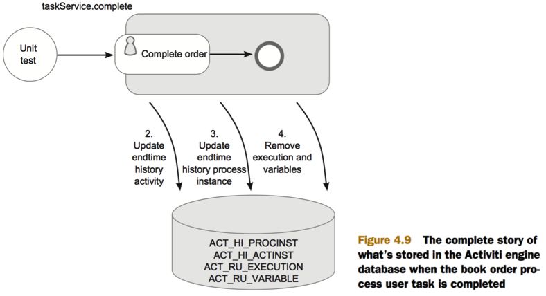

#Activiti
[官网](http://www.activiti.org/)
[中文文档](http://www.mossle.com/docs/activiti/#N10007)

activiti是轻量级的工作流和业务流程管理（BPM）平台，核心是BPMN2流程Java引擎。

- Activiti Engine：核心组件
- Activiti Modeler：web上的BPMN2.0建模工具
- Activiti Designer：Eclipse 插件，用于在Eclipse中绘制bpmn文件
- Activiti Exploer：web应用，用于部署和控制流程，查看数据库表和管理用户
- Activiti REST：web应用，提供Activiti Engine 的REST接口。

##关键对象

###Deployment
流程部署对象

可部署各种资源，如流程定义，业务规则，流程定义图像等。

###ProcessDefinitions
流程定义

1. 定义流程中各个节点的结构和行为，部署成功后自动创建流程定义
2. 对应一个.bpmn文件中Process部分
3. ProcessDefinitionID的格式为流程定义ID：版本号：所在数据库ID。例如simplebookorder:1:3


###ProcessInstances
流程实例

流程定义的执行过程，对每个流程定义来说，同一时间会有很多实例在执行

**如果同一个流程定义被发布多次，那么Activiti将默认采用最新版本**

###Task
任务

1. 流程在流转过程中的一个原子活动，流程中的工作不能被拆分到更细粒度
2. 在Activiti 中的Task仅指有角色参与的任务，即定义中的UserTask

###Execution
流程执行实例  

流程实例和流程执行中的所有节点都是Execution，如UserTask、ServiceTask 等。

**Activiti中关于 流程实例 和 流程执行实例 的区别**
ProcessInstance是流程实例，Execution是流程的一个执行实例。一个流程在并发分支的情况下，会产生多个执行实例，一个Execution也可以分出多个Execution

###ActivitiRule
在单元测试前部署流程定义

1. Activiti JUnit4的单元测试功能封装在ActivitiRule中，ActivitiRule继承自TestWatchman
2. 创建ActivitiRule时，会搜索classpath下的activiti.cfg.xml文件以构造Activiti Engine
3. 通过@Deployment(resources=”  ,  ”)指定流程定义文件    
**@Deployment会在测试完后清空流程实例，用户任务等。**

##关键接口

###ProcessEngineConfiguration
流程引擎配置

通过ProcessEngineConfiguration.createXXX()返回ProcessEngineConfiguration对象。

createXXX分为两类：一类传入activiti.cfg.xml文件路径；一类采用默认内置的H2数据库。

###ProcessEngine

流程引擎接口，提供流程管理和运作的所有接口。

获取方式：

1. ProcessEngines获取默认ProcessEngine
	
		ProcessEngine processEngine = ProcessEngines.getDefaultProcessEngine();

2. 搜索classpath下得activiti.cfg.xml文件

		ProcessEngineConfiguration. buildProcessEngine()

使用方式：
	
提供获取所有Service的接口

* RuntimeService runtimeService = processEngine.getRuntimeService();
* RepositoryService repositoryService = processEngine.getRepositoryService();
* TaskService taskService = processEngine.getTaskService();
* ManagementService managementService = processEngine.getManagementService();
* IdentityService identityService = processEngine.getIdentityService();
* HistoryService historyService = processEngine.getHistoryService();
* FormService formService = processEngine.getFormService();

###RepositoryService
管理部署（Deployments）和流程定义（Process Definitions）。用于管理静态资源。

获取方式：	

	RepositoryService repositoryService = processEngine.getRepositoryService();

使用方式：


1. 查询部署

		DeploymentQuery deploymentQuery= repositoryService.createDeploymentQuery();
2. 查询流程定义

		ProcessDefinitionQuery processDefinitionQuery = repositoryService.createProcessDefinitionQuery();

3. 部署和删除流程定义

		DeploymentBuilder deploymentBuilder = repositoryService.createDeployment();
		Deployment deployment = deploymentBuilder.addClasspathResource(String  resource). deploy();
		String deploy_id = deployment.getId();
		repositoryService.deleteDeployment(deploymentID, true);
		如果为true，则流程定义和其关联的流程实例一起删除
		如果为false，则只删除流程定义，不删除流程实例，如果有关联的流程实例，则抛异常

###RuntimeService

运行时服务接口，提供流程启动服务，运行中流程查询，运行变量设置和获取。

获取方式：

	RuntimeService runtimeService = processEngine.getRuntimeService();

使用方式：

1. 启动流程实例

		ProcessInstance processInstance = runtimeService.startProcessInstanceByKey("bookorder", variableMap);

		startProcessInstanceByKey(String processDefinitionKey)会立刻创建并执行流程实例，直到遇到wait状态时才返回流程实例
		UserTask是让其遇到Wait状态的情况之一，Script Task不是。		

		startProcessInstanceById(String processDefinitionID)，processDefinitionID由RepositoryService部署时返回
		
		区别是同一流程名称PD_KEY可能有多个流程定义，startProcessInstanceByKey总是以最新的流程定义创建流程实例，startProcessInstanceById是以某个流程定义创建流程实例。

2. 查询流程实例
	

		List<ProcessInstance> instanceList = runtimeService .createProcessInstanceQuery().processDefinitionKey("bookorder")
.list();
		返回某个流程定义的所有流程实例，如果需要指定某个实例，用processDefinitionId

3. 查询流程实例变量	
	
		获取某个流程实例的某个变量的值
		runtimeService.getVariable(processInstance.getId(), "validatetime");

###TaskService

用户任务接口（UserTask），提供运行时任务查询、领取、完成、删除及变量设置用户管理等服务。
获取方式：
	
	TaskService taskService = processEngine.getTaskService();

使用方式：

1. 查询任务
	
		TaskQuery tq = TaskService.createTaskQuery();  //创建查询条件
		tq.taskCandidateUser();                        //任务所有者
		tq.processDefinitionKey();		                //流程定义key
		tq.taskId(String id);  			                //任务ID
		tq.taskCandidateUser(String userID);           //候选人ID
		tq.taskAssignee(String userID);                //负责人ID
		tq.taskCreatedAfter(Date date);                //任务创建时间在这之后
		tq.taskCreatedBefore(Date date);               //任务创建时间在这之前
		tq.taskDescriptionLike(String desc);           //任务描述正则式

		//按照任务创建时间升序创建查询
		TaskQuery tqu = tq.orderByTaskCreateTime().asc();
		//返回查询到的Task
		List<Task> results = tqu.list();

2. 认领和完成任务

		Task task = taskService.newTask();
		taskService.saveTask(task);
		taskService.addCandidateUser(taskID,  userID);
		taskService.claim(taskID, userID);
		taskService.complete(taskID);
		任务优先级为[0,100]，默认为50


###IdentityService

用户和组管理接口

获取方式：

	IdentityService identityService = processEngine.getIdentityService();

使用方式：

1. 用户操作
	
		User newUser = identityService.newUser(String userID);
		identityService.saveUser(newUser);
		UserQuery userQuery = identityService.createUserQuery();

2. 组操作		

		Group newGroup = identityService.newGroup(String groupId);
		identityService.saveGroup(newGroup);
		GroupQuery groupQuery = identityService.createGroupQuery()

3. 其他操作

		identityService.createMembership(String userID,  String groupID);
		将用户加入组
		identityService.setAuthenticatedUserId("John Doe");
		设置任务发起人，也可在bpmn文件中配置userID=starter的为活动发起人
		<startEvent id="startEvent" activiti:initiator="starter" />

###ManagementService
流程引擎管理接口

获取方式：

		ManagementService managementService = processEngine.getManagementService();
使用方式：

1. 查询数据库的表和表的元数据；
2. 查询和管理异步操作的功能，如定时器，延迟暂停激活等。


###HistoryService

流程处理查询接口，包括执行中流程查询和历史流程查询。

流程启动时保存流程信息，活动启动时保存活动信息，更新活动结束时间。

活动结束时更新活动结束时间，流程结束时更新流程结束时间，最后删除运行时的信息和变量。当full时，流程变量将保存到ACT_HI_DETAIL中。

配置：
	
	通过activiti.cfg.xml中设置Activiti Engine的属性，设置输出日志等级：
	<bean id="processEngineConfiguration" class="org.activiti.spring.SpringProcessEngineConfiguration">
	<property name="deploymentResources" value="classpath*:/*.bpmn" />
		<property name="history" value="full" />
	</bean>

- None：不输出
- Activity：归档流程和活动信息
- Audit：默认，归档流程、活动、表属性
- Full：在Audit基础上，归档流程变量和用户任务的表属性

获取方式：
	
	HistoryService historyService = processEngine.getHistoryService();

使用方式：

1. 获取历史流程
	
		HistoricProcessInstanceQuery historicProcessInstanceQuery=historyService
.createHistoricProcessInstanceQuery()
		HistoricProcessInstance historicProcessInstance =
historicProcessInstanceQuery.processInstanceId(processInstanceID).singleResult();

2. 获取历史活动
	
		HistoricActivityInstanceQuery historicActivityInstanceQuery = historyService.createHistoricActivityInstanceQuery()

3. 获取历史细节（在full等级生效）

		HistoricDetailQuery historicDetailQuery = historyService.createHistoricDetailQuery()

###FormService

可选，提供了启动表单和任务表单两个概念。启动表单会在流程实例启动之前展示给用户，任务表单会在用户完成任务时展示。
获取方式：
	
	FormService formService = processEngine.getFormService();

配置bpmn文件：

	<activiti:formProperty id="name" name="Name" required="true" type="string" />
	默认type为string，还可为long，boolean，enum，date。

使用方式：

	List<FormProperty> formList = formService.getStartFormData(definition.getId()).getFormProperties();
	formService.submitStartFormData(definition.getId(), formProperties);

##持久化
Activiti使用到的表都是ACT_开头的。

- ACT_RE_*：RepositoryService接口所操作的表
- ACT_ID_*：IdentityService接口所操作的表
- ACT_RU_*：运行时表 - RuntimeService接口所操作的表
- ACT_HI_*：历史数据表，HistoryService接口所操作的表
- ACT_GE_*：全局数据

注：由于Activiti会在任务或者流程结束时，删除其所在的运行时数据，存入历史数据表。所以保证了运行时表小且快。不会有性能问题。

###ACT_GE_BYTEARRAY
二进制数据表：流程定义图片和xml、Serializable的变量

字段|类型|含义
---:|:---:|:---
ID_|varchar(64)|主键
REV_|int(11)|
NAME_|varchar(255)|
DEPLOYMENT_ID_|deployment主键|
BYTES_|longblob|
GENERATED_|tinyint(4)|


###ACT_GE_PROPERTY
属性数据表。存储整个流程引擎级别的数据

字段|类型|含义
---:|:---:|:---
NAME_|varchar(64)|属性名称
VALUE_|varchar(300)|属性值
REV_|int(11)|版本号

例如：

NAME_|VALUE|REV_
---:|:---:|:---
schema.history|create(5.11)|1
schema.version|5.11|1

###ACT_HI_ACTINST
历史流程实例表

字段|类型|含义
---:|:---:|:---
ID_|varchar(64)|主键
PROC_DEF_ID_|varchar(64)|ProcessDefinition主键
PROC_INST_ID_|varchar(64)|ProcessInstance主键
EXECUTION_ID_|varchar(64)|Execution主键
ACT_ID_|varchar(255)|Activity主键
TASK_ID_|varchar(64)|Task主键
CALL_PROC_INST_ID_|varchar(64)|
ACT_NAME_|varchar(255)|Activity名称
ACT_TYPE_|varchar(255)|Activity类型，可为userTask，exclusiveGateway，startEvent…
ASSIGNEE_|varchar(64)|任务分配人
START_TIME_|datetime|开始时间
END_TIME_|datetime|结束时间
DURATION_|bigint(20)|持续时长，START_TIME_-END_TIME_

例如：

ID_|PROC_DEF_ID_|PROC_INST_ID_|EXECUTION_ID_|ACT_ID_|TASK_ID_|CALL_PROC_INST_ID_|ACT_NAME_|ACT_TYPE_|ASSIGNEE_|START_TIME_|END_TIME_|DURATION_
---:|:---:|:---:|:---:|:---:|:---:|:---:|:---:|:---:|:---:|:---:|:---:|:---
100012|gl_ro:5:23709|99990|99990|ut_write_bill|100013||填写报销审批表|userTask||2013-08-26 15:13:11|2013-08-26 15:13:11|23

###ACT_HI_ATTACHMENT
历史附件表 

###ACT_HI_COMMENT
历史注释表 

字段|类型|含义
---:|:---:|:---
ID_|varchar(64)|主键
TYPE_|varchar(255)|类型
TIME_|datetime|时间
USER_ID_|varchar(255)|ACT_ID_USER主键
###ACT_HI_DETAIL
历史详情表 

###ACT_HI_PROCINST
历史流程实例表


###ACT_HI_TASKINST
历史任务实例表

###ACT_HI_VARINST
历史变量表

###ACT_ID_GROUP
用户组信息 

###ACT_ID_INFO
用户扩展信息表

###ACT_ID_MEMBERSHIP
用户与分组对应信息表

###ACT_ID_USER
用户信息

###ACT_RE_DEPLOYMENT
部署流程定义时需要被持久化保存下来的信息
###ACT_RE_MODEL

###ACT_RE_PROCDEF
流程定义数据表
###ACT_RU_EVENT_SUBSCR

###ACT_RU_EXECUTION
流程执行路径信息

###ACT_RU_IDENTITYLINK
任务参与者表。主要存储任务节点与参与者的相关信息

###ACT_RU_JOB
定时任务表

###ACT_RU_TASK
任务节点表


###ACT_RU_VARIABLE
运行时流程变量表

##配置文件

    <?xml version="1.0" encoding="UTF-8"?>  
      
    <beans xmlns="http://www.springframework.org/schema/beans"   
           xmlns:xsi="http://www.w3.org/2001/XMLSchema-instance"  
           xsi:schemaLocation="http://www.springframework.org/schema/beans   http://www.springframework.org/schema/beans/spring-beans.xsd">  
             
        <bean id="dataSource" class="org.apache.commons.dbcp.BasicDataSource" >  
          <property name="driverClassName" value="com.mysql.jdbc.Driver" />  
          <property name="url" value="jdbc:mysql://localhost:3306/activiti" />  
          <property name="username" value="root" />  
          <property name="password" value="leonsu" />  
          <property name="defaultAutoCommit" value="false" />  
        </bean>  
          
        <bean id="processEngineConfiguration" class="org.activiti.engine.impl.cfg.StandaloneProcessEngineConfiguration">  
            <property name="databaseSchemaUpdate" value="true"/>  
      
            <!--  
            <property name="jdbcUrl" value="jdbc:h2:tcp://localhost/activiti" />  
            <property name="jdbcDriver" value="org.h2.Driver" />  
            <property name="jdbcUsername" value="sa" />  
            <property name="jdbcPassword" value="" />  
            -->  
      
            <property name="dataSource" ref="dataSource" />  
      
            <property name="jobExecutorActivate" value="true" />  
        </bean>  
      
    </beans>  

##结合Spring

1.Spring中定义数据连接及事务管理


	<bean id="dataSource"
	class="org.springframework.jdbc.datasource.DriverManagerDataSource">
	<property name="driverClassName" value="com.mysql.jdbc.Driver" />
	<property name="url"
	value="jdbc:mysql://localhost:3306/boss?autoReconnect=true&amp;characterEncoding=UTF-8&amp;characterSe
	tResults=UTF-8" />
	<property name="username" value="root" />
	<property name="password" value="" />
	</bean>
	<bean id="transactionManager"
	class="org.springframework.jdbc.datasource.DataSourceTransactionManager">
	<property name="dataSource" ref="dataSource" />
	</bean>
	
2.配置activiti

	<bean id="processEngineConfiguration" class="org.activiti.spring.SpringProcessEngineConfiguration">
	<property name="dataSource" ref="dataSource" />
	<property name="transactionManager" ref="transactionManager" />
	<property name="databaseSchemaUpdate" value="true" />
	<property name="jobExecutorActivate" value="false" />
	<property name="mailServerHost" value="mail.xxxx.com" />
	<property name="mailServerPort" value="25" />
	<property name="mailServerDefaultFrom" value="lwp@meituan.com" />
	<property name="mailServerUsername" value="xxxx" />
	<property name="mailServerPassword" value="xxxx" />
	</bean>

##常规使用
1.定义流程引擎

	<bean id="processEngine" class="org.activiti.spring.ProcessEngineFactoryBean">
	<property name="processEngineConfiguration" ref="processEngineConfiguration" />
	</bean>

2.定义流程中使用的对象


	<bean id="myServiceTask" class="com.meituan.oa.MyServiceTask">
	<property name="processEngine" ref="processEngine" />
	</bean>
	<bean id="myActivityBehavior" class="com.meituan.oa.MyActivityBehavior">
	<property name="processEngine" ref="processEngine" />
	</bean>
	<bean id="myExecutionListener" class="com.meituan.oa.MyExecutionListener">
	</bean>
	<bean id="valueBean" class="com.meituan.oa.VOBean">
	<property name="value" value="吃饭了少年" />
	</bean>

3.部署流程

	RepositoryService repositoryService = processEngine.getRepositoryService();
	Deployment deployment = repositoryService.createDeployment()
	.addClasspathResource("MyProcess.bpmn20.xml")
	.deploy();
	还可以通过字符串，zip 包，inputStream等方式部署流程。

4.启动流程


	RuntimeService runtimeService = processEngine.getRuntimeService();
	ProcessInstance processInstance = runtimeService.startProcessInstanceByKey("MyProcess");

5.查询任务

	流程定义中，第一个任务是指定角色为owner处理的。
	<potentialOwner>
	<resourceAssignmentExpression>
	<formalExpression>owner</formalExpression>
	</resourceAssignmentExpression>
	</potentialOwner>
	取得任务接口
	TaskService taskService = processEngine.getTaskService();
	查询流转到owner 的任务
	List<Task> tasks = taskService.createTaskQuery().taskCandidateGroup("owner").list();

6.分配任务

	如果lwp 是owner下的一个用户
	for (Task task : tasks) {
	// lwp领取任务
	taskService.claim(task.getId(), "lwp");
	}

7.完成任务

	查询用户lwp 可处理的任务
	tasks = taskService.createTaskQuery().taskAssignee("lwp").list();
	for (Task task : tasks) {
	//完成任务
	taskService.complete(task.getId());
	}

##相关的查询


流程部署查询


	DeploymentQuery deploymentQuery = repositoryService.createDeploymentQuery();
	List<Deployment> deploymentList = deploymentQuery.list();


流程定义查询


	ProcessDefinitionQuery processDefinitionQuery = 	repositoryService.createProcessDefinitionQuery();


	List<ProcessDefinition> processDefinitionList = processDefinitionQuery.orderByProcessDefinitionId().asc().list();


处理中的流程实例查询


	RuntimeService runtimeService = processEngine.getRuntimeService();
	List<ProcessInstance> processInstanceList = runtimeService.createProcessInstanceQuery().list();


处理完成的流程实例查询


	HistoricProcessInstanceQuery historicProcessInstanceQuery = processEngine.getHistoryService()
	.createHistoricProcessInstanceQuery();
	List<HistoricProcessInstance> historicProcessInstanceList =
	historicProcessInstanceQuery.finished().orderByProcessInstanceStartTime().asc().list();

流程处理记录查询


	1.仅得到流程中的UserTask节点
	HistoricTaskInstanceQuery historicTaskInstanceQuery = processEngine.getHistoryService()
	.createHistoricTaskInstanceQuery();
	List<HistoricTaskInstance> historicTaskInstanceList = 	historicTaskInstanceQuery.processInstanceId(processInstanceId)
	.orderByHistoricActivityInstanceStartTime().asc().list();
	2.查询流程中所有节点
	HistoricActivityInstanceQuery
	historicActivityInstanceQuery=processEngine.getHistoryService().createHistoricActivityInstanceQuery();
	List<HistoricActivityInstance> historicActivityInstanceList =
	historicActivityInstanceQuery.processInstanceId(processInstanceId).orderByHistoricActivityInstanceStartTime().
	asc().list();

##常用的节点

1. Start events 流程的开始，必须。
2. Timer start event 用于定时启动的流程，可定时启动一次，或按时重复启动流程。
3. Sequence flow 描述当前的节点（开始事件，任务，子流程、结束事件等）完成后流转到哪里
4. 有条件的顺序流 当前节点在满足定义条件后的流转方向。
5. 默认的顺序流 用于Gateway之后，和条件顺序流同时存在，不满足所有条件的时候流转去哪里。
6. Exclusive gateway 互斥关口，流程经过关口后只会走一个顺序流，即使关口后的顺序流都是无条件的。
7. Parallel Gateway 并行关口，用在开头，流程经过关口后会同时经过所有顺序流，用在结尾，所有流程完成后会一起通过并行关口。
8. User task 人工任务，必须要有人或人的组参与。
9. Script Task 脚本任务，可以执行一段脚本，Javascript，grove都可以使用，可以在脚本中定义或修改变量，来控制流程的流转
10. Java Service Task 业务任务