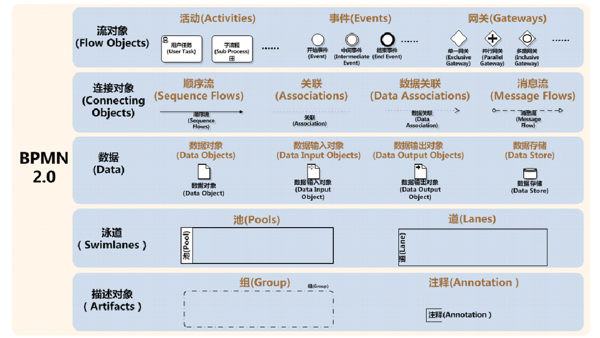
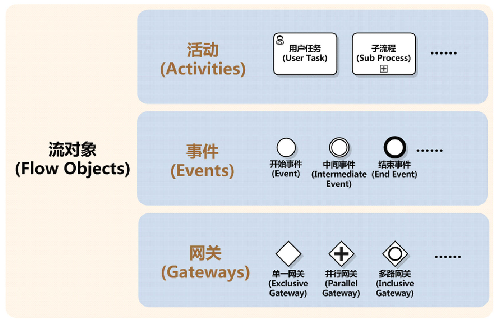
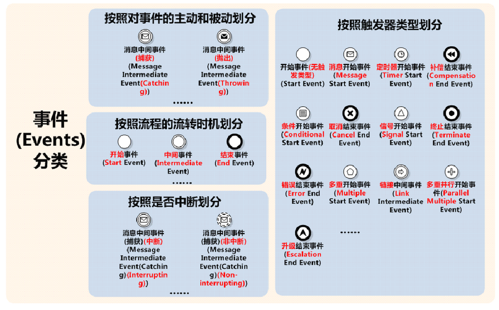
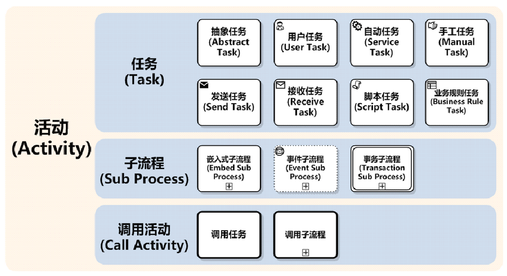
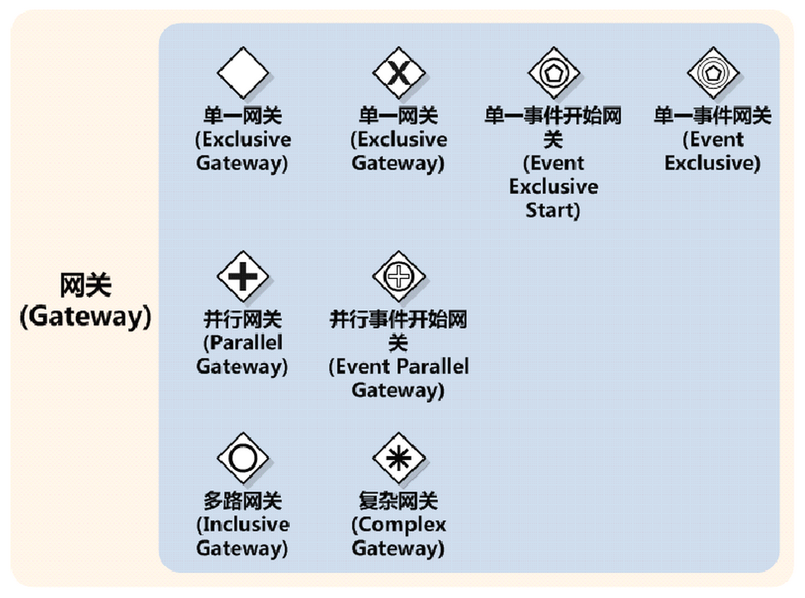
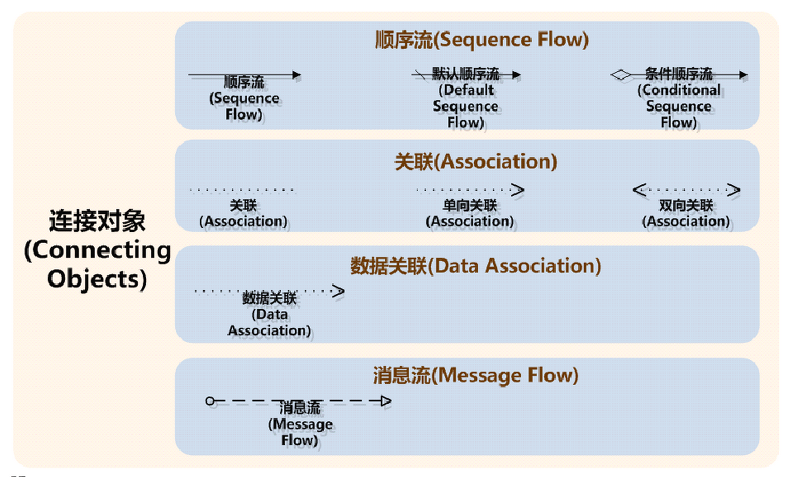
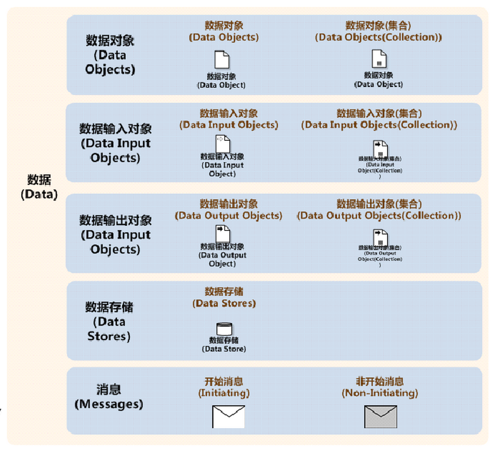
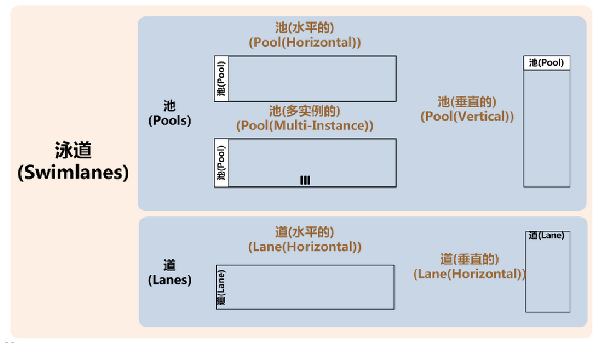
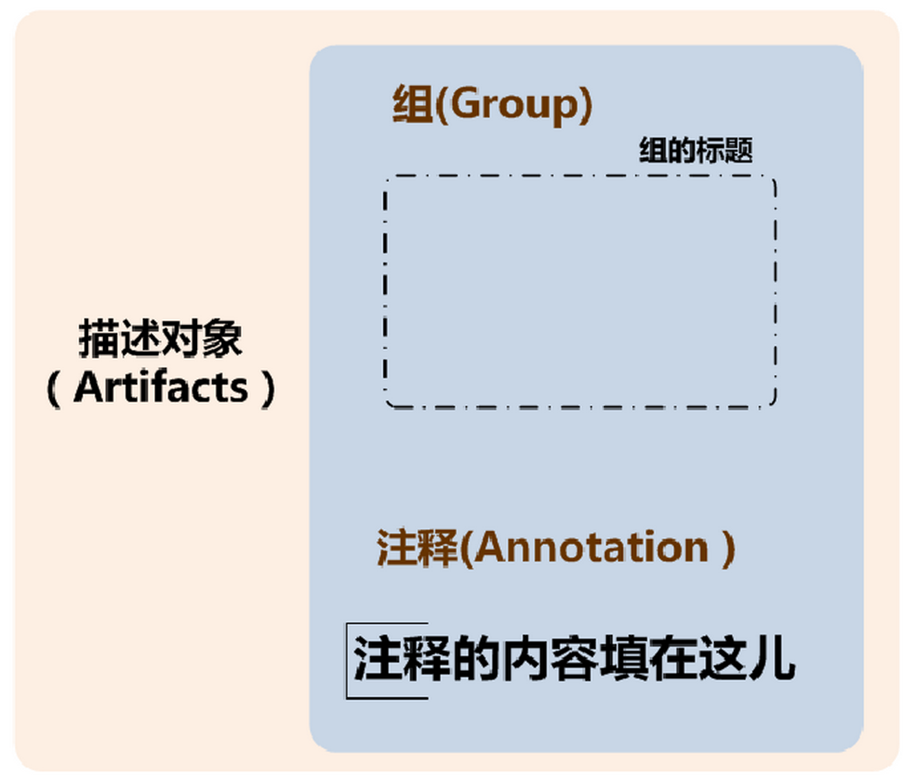
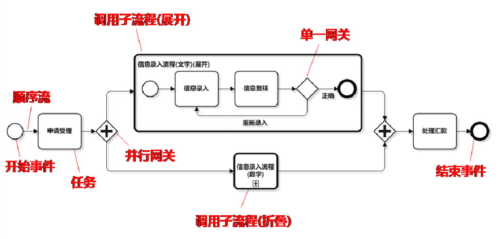

#BPMN2.0
##一、BPMN简介
* BPMN（Business Process Model And Notation）- 业务流程模型和符号
* 是由BPMI（Business Process Management Initiative）开发的一套业务流程建模符号。 
* 2004年5月发布了BPMN1.0规范.BPMI于2005年9月并入OMG（The Object Management Group)组织。OMG于2011年1月发布BPMI2.0的最终版本。
* 为什么需要BPMN?  
	在BPMN出现之前，关于流程设计的符号并没有统一的标准，各个大的流程模型设计公司都有自己流程定义符号。这样在理解和沟通上就给大家造成了不便。所以BPMI组织就推出了BPMN这个标准，来统一业务流程描述符号。
	
 

 
##二、BPMN核心(Core)结构
 
 
核心结构包括三个部分:

1. **Foundation:** BPMN建模所需的基础结构。
2. **Service:** 服务和接口建模的基础结构。
3. **Common:** 流程、编排、合作的基础类。

##三、BPMN2规范内容

###1.BPMN2-Conformance 一致性

* Process Modeling Conformance 流程模型一致性

* Process Execution conformance 流程执行一致性

* BPEL Process Execution Conformance BPEL 流程执行一致性

* Choreography Modeling Conformance 编排模型一致性

###2.BPMN2-Element 元素
BPMN2.0的元素分为5类：

####(a)Flow Objects流对象

1. Events 事件

		Event 用一个圆圈表示，它是流程中运行过程中发生的事情。事件的发生会影响到流程的流转.事件包含Start\Intermediate\End三种类型.

	
2. Activities 活动
		
		活动用圆角矩形表示，一个活动多个活动组成，活动的类型分为Task和Sub Process。
		Task：任务，流程在流转过程中的一个`原子`活动，流程中的工作不能被拆分到更细。
		Sub Process：子流程，折叠和展开两种状态
	

		
		
3. Gateways 

		网关用菱形表示,用于控制流程的分支和聚合.

#### (b)Connecting Objects连接对象

* 1.Sequence Flows 序列流

		Sequence Flows 用实线实心箭头表示，代表流程中将被执行的活动的执行顺序.

* 2.Message Flows 消息流

		Message Flows 用虚线空心箭头表示，2个分开的流程参与者直接发送或者接收到的消息流.

* 3.Associations 结合关系

		Associations 用点状虚线表示，用于显示活动的输入输出.

* 4.Data Associations 数据结合关系

#### (c)Data数据
* 1.Data Objects 数据对象

* 2.Data Inputs 数据输入

* 3.Data OutPuts 数据输出

* 4.Data Stores 数据存储

####(d)Swimlanes 泳道
许多建模技术利用泳道这个概念将活动划分到不同的可视化类别中来描述由不同的参与者的责任与职责。BPMN支持2种主要的泳道构件：

* 1.Pools 池
	
		池描述流程中的一个参与者。可以看做是将一系列活动区别于其他池的一个图形容器，一般用于B2B的上下文中。

* 2.Lanes 道

		道就是在池里面再细分，可以是垂直的也可以是水平的。道也是用于组织和分类活动。

####(e)Artifacts 工件

* 1.Group 组

* 2.Text Annotation 文本注释

###实例
	

