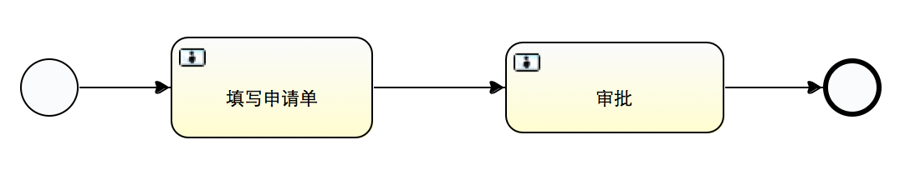

#第一个流程

##前提条件

###知识准备
了解BPMN2.0，activiti（参考备注里的资料）

###环境准备
**安装eclipse activit插件**  
Help -> Install New Software.   
Name: Activiti BPMN 2.0 designer  
Location: http://activiti.org/designer/update/  

确认Contact all updates sites..勾选，以下载新版本。 
**mtoa项目下载并配置成功**  
具体参考1st_day.md

##定义流程图
在src/main/resources的bpmn目录下，新增folder，名称为模块名。  
File->New->Other的Activiti中选择Activiti Diagram，输入文件名。  
在打开的Design界面画流程图，选择最简单的例子：只有开始和结束，没有中间过程，如图：  

**注意事项：**  

1. 流程图的命名要有语义，格式为：模块_流程名称缩写，如gl_lo.bpmn，gl为总账模块，lo为借款流程。
2. 清除多余元素。Activit diagram插件有缺陷，在Design界面删除的元素，可能在源文件中仍保留，注意核对源文件，确保文件没有多余元素。
3. bpmn文件中的命名尽量不要包含空格

##验证测试用例

利用刚设计的流程图，调用BPM服务，验证是否能成功执行流程，再在其基础上添加复杂的业务逻辑。

1. 测试须继承自AbstractTestNGSpringContextTests，
2. ContextConfiguration引入/spring/mt.oa.test.xml文件
3. 注入AuthenticateBizService，BpmManagementBizService，BpmBizService三类服务

调用服务：	
	
	AuthenticateBizService用于获取用户信息
	ClientEnv env = authService.loginEnv(account_code);
	
	BpmManagementBizService用于部署流程
	List<String>：流程定义文件的路径列表
	返回值：部署ID
	String deploy_id = bpmManageService.deploy(Arrays.asList("bpmn/gl/gl_ro.bpmn"));
	//删除部署
	bpmManageService.unDeploy(deploy_id);
	
	BpmBizService用于流程流转
	pd_key：流程ID，bpmn文件中Process的ID
	work_item：流转参数，必须包含pk_work_item，pk_work_item为主键值
	message：消息
	env：用户信息	
	bpmService.start("ts_first", work_item, "publish", env);

**注意事项：**  

1. 慎用@Deployment注释。当使用@Deploment注释进行测试时，会清除数据库记录。   

必须设置连接本地MySQL数据库

	//拷贝远程数据到本机
	dwt ~ $ mysqldump --host=192.168.2.165 -udev -p1qazxsw2 -C -R mtoa|mysql -uroot -p mtoa
	
	//打开mt.oa.dev.data.properties，192.168.2.165改为127.0.0.1
	jdbc.url=jdbc:mysql://127.0.0.1/mtoa?useUnicode=true&characterEncoding=utf-8&zeroDateTimeBehavior=convertToNull
	jdbc.username=root
	jdbc.password=
	
2. 因为不能用一个主键值重复发起流程实例，如需重复发起，须进行以下配置：

第一步，修改activiti.cfg.xml

将jobExecutorActivate改为false，关闭任务调度。

	<property name="jobExecutorActivate" value="false" />
第二步，bpmService.start的传入参数须包含参数pk_work_item。
	
	GenericVO work_item = new GenericVO().set("pk_work_item","pk_value_1");
	proc_inst_id = bpmService.start("ts_first", work_item, "发布要求", env);

第三步，流程注册，系统的业务加工->流程注册->新增
	
	流程编码：Process ID
	流程名称：写个易于理解的名称
	单据编码：格式：xxx_xxx_bill
	单据编号属性：格式：XXX_CODE
	扩展类：提供清除流程或流程执行前后的校验和处理
	
第四步，测试结束后，清除流程实例和流程部署

####Demo

	@ContextConfiguration("classpath:/spring/mt.oa.test.xml")
	public class TaskSecondTestCase extends AbstractTestNGSpringContextTests{
		@Autowired
		@Qualifier("pf.sa.service.authentication")
		AuthenticateBizService authService;
		@Autowired
		@Qualifier("pf.bpm.management.service")
		BpmManagementBizService bpmManageService;
		@Autowired
		@Qualifier("pf.bpm.service")
		BpmBizService bpmService;
	

		@Test
		public void testAll(){
			String deploy_id = null;
			String proc_inst_id = null;
			ClientEnv env = null;
			try {
				//bpmn文件路径
				String bpm_resouce = "bpmn/ts/ts_req.bpmn";
				//模拟用户登录
				String account_code = "dongwenting02";
				env = authService.loginEnv(account_code);
				//部署流程
				deploy_id = bpmManageService.deploy(Arrays.asList(bpm_resouce));
			
				GenericVO work_item = new GenericVO().set("pk_work_item","pk_value_1");
				//创建流程实例
				proc_inst_id = bpmService.start("ts_first", work_item, "发布要求", env);
			} catch (Exception e) {
				TestCaseHelper.processError(e);
			}finally{
				try {
					if(AssertHelper.isNotEmptyStr(proc_inst_id)){
						//清除流程实例
						bpmManageService.cleanProcInstByID(proc_inst_id, env);
					}
					if(AssertHelper.isNotEmptyStr(deploy_id)){
						//清除流程部署
						bpmManageService.unDeploy(deploy_id);
					}
					
				} catch (Exception e2) {
					TestCaseHelper.processError(e2);
				}
			}
		}
	}

***原生接口举例***

TODO，请参看activiti.md

##修改流程图
修改上面的流程图，添加一些基本的业务功能。  
比如审批申请单：第一步填写申请单，第二步审批，审批需要设置审批人  
  

审批的UserTask中需要指定审批人：

	activiti:candidateUsers="liuwenping"

##修改测试用例
修改上面的测试用例，模拟某用户的登录过程，完成分配到自己的任务。

	List<String> user_list = Arrays.asList("liuwenping");
	for(String user: user_list){
		ClientEnv user_env = authService.loginEnv(user);
		//查询某用户的所有任务
		List<Task> user_task = bpmService.fetchTaskList("ts_app", user_env);
		for(Task task: user_task){
			String task_id = task.getId();
			//获取任务中的单据编码
			String bill_code = bpmService.getFormValue(task_id, "bill_code");
			//获取任务评论列表
			List<GenericVO> comments = bpmService.fetchCommentList(task_id);
			//当前用户执行任务
			bpmService.commit(task_id, "审批通过", user_env);
		}
	}
##总结
第一步：设计流程定义文件，即.bpmn文件，然后部署。   
用户任务配置：
   
    //activiti:candidateUsers设置当前用户任务由谁负责
    //参数为主键值和执行信息类，返回用户主键列表
    public List<String> find(String pk_work_item, DelegateExecution execution)
    
    <userTask id="ut_demand_split" name="要求拆分" activiti:candidateUsers="#{candidate.find(pk_work_item,execution)}">
    
      //任务描述
      <documentation>${PK_ACCOUNT_CRT_NAME}发布的要求,需要您拆分成要求条款</documentation>
      <extensionElements>
      
      //新建任务时调用process_listener，该类必须继承自TaskListener
      //实现public void notify(DelegateTask delegateTask)接口，支持create，assignment，complete三类事件     
       
      <activiti:taskListener event="create" delegateExpression="${process_listener}"></activiti:taskListener>
      </extensionElements>    
    </userTask>
 
流程事件配置:
    
   	//设置流程实例执行结束时会调用process_listener服务，该类必须继承自ExecutionListener
   	//实现public void notify(DelegateExecution execution) 接口，支持start，end，take三类事件
  
    <extensionElements>
      <activiti:executionListener event="end" delegateExpression="${process_listener}"></activiti:executionListener>
    </extensionElements>

第二步：根据具体业务逻辑，实现上面的各种类   
第三步：业务加工->流程注册中，新增流程注册信息，在业务中心->发起新流程中，可看到注册的流程。   
可能需要实现扩展类：	
	
	扩展类继承自ProcDefExtBizService
	//任务开始前执行的操作
	public void validateForStart(GenericVO context, ClientEnv client)
	//删除流程实例前执行的操作
	public void validateForClean(GenericVO context, ClientEnv client)
	//删除流程实例后执行的操作
	public void executeForClean(GenericVO context, ClientEnv client)
	//任务开始后执行的操作
	public void executeForStart(GenericVO context, ClientEnv client)
	
##部署
1. git提交代码
2. 部署环境
3. 部署流程
4. 流程注册

##问题
**问题：报错：当前单据正在处理中….**   
修改pk_work_item的值  

**问题：activiti:candidateUsers="${assignee}"是什么意思**   
对应着activiti:elementVariable="assignee"   
是指遍历所有用户，以当前指向的用户赋给candidateUser

**问题：在发起新流程中，前端默认搜索static/${pd_key}/update.js文件，该文件其实就是功能节点中新增对应的update.js，如何让其指向功能节点的update文件，从而不用写重复文件？**   

**问题：提交按钮打开不了备注框，进入不了流程**  
istat必须为0或7，请求url中包含isFromIndex   
 跟踪flow.js到
 if (iStat === 0 || iStat === 7) {
 	
 }
 必须进入这个分支，才能进入流程
**问题：istat如何设置**   
在单据模板中需要设置rangeset，前端会将default对应的值覆盖istat，前端会判断ISTAT等于0且isFromIndex=1时才启动流程

**问题：链接本地数据库后，每次打开系统主页，会报错**  
表没有考全  
mysql > select * from mysql.proc;   
看看有没有urlquote方法
**问题：不能删除已完成的单据，否则流程关联时会找不到单据，该如何设置删除按钮，预先判断单据状态**   
搜索beforeDeleteRows

**现存问题**    
驳回没有考虑，要求必须拆分成条款，否则multiinstance返回0报错，发布撤回按钮

**form的含义，什么场景下使用，form中的bill_code和action又如何被使用？**

**XmppService是做什么的**     

**本机同步表，表名变为大写了，什么原因？**

**ExecutionListener,TaskListener什么时候会被调用**
ExecutionListener可以注册监听整个流程的开始结束，
TaskListener对应流程中得单个Task

##备注
####bpmn2.0资料
[官网](http://www.bpmn.org/)  
docs/java/common/bpmn2.0.md

####activiti资料
[官网](http://www.activiti.org/)  
[书籍Activiti in action](http://download.csdn.net/detail/haoliling1986/6314207)