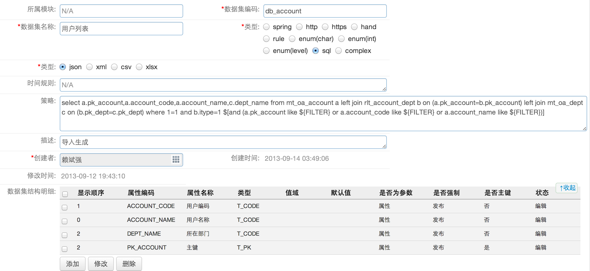
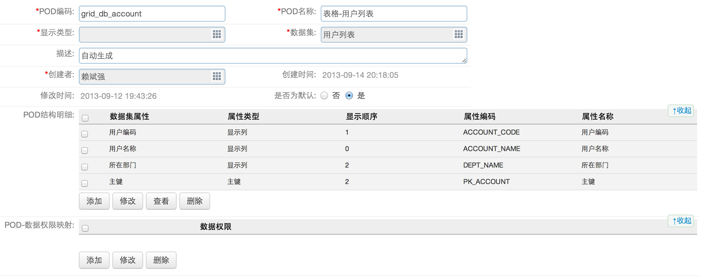
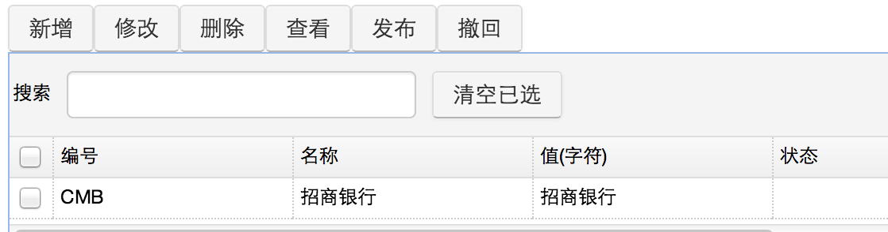

# 数据集
## 摘要
现有业务系统中，数据来源比较多样，不再单纯来自于具体某一个业务模块，为了确保数据服务的消费者可以无差别的，不关来源的使用数据，有必要将数据本身抽象出来成为一个服务
## 应用场景

* 报表中，数据的定义与展现设置的分离，便于集成外系统业务数据
* 构成参照，扩展表单的属性值域类型
* 数据授权，对两个任意的业务对象集合进行映射，建立关系，以达到数据授权的设定的目的
* 直接将外系统的数据映射成一个数据集，一个本地服务调用的方式，简化业务开发

## 使用方法

使用主要涉及`数据集服务`，`DataPod`，`自定义档案`三个模块。  
**以配置一个最简单的db_account数据集为例**  
###配置数据集
数据集的主要作用是为datapod提供数据源。

* 单击OA系统-业务加工-数据集服务-新增

  

		所属模块：可选，用于标识该数据集属于哪个模块
		数据集编码：必填，按规定命名，类型为sql时以db_开头，类型为enum时以enum_开头，再加上业务含义简写
		数据集名称：必填，字面意思
		类型：必填，选sql，则须填写策略，选enum，则须配置自定义档案
		类型：必填，返回类型，一般选json
		时间规则：可选，没用过???
		策略：可选，类型为sql时，拼写SQL语句，select返回值必须包含数据集结构明细中所有的属性编码
		描述：可选，描述一下该数据集
		数据集结构明细：必填
			对类型为enum的数据集，不用配置，直接保存，后台会自动配置好数据集结构明细
			对类型为sql的数据集，需配置数据集结构明细
			以下内容在配置datapod时会带出
			* 显示顺序：最好与datapod中顺序保持一致
			* 属性编码：SQL返回字段编码
			* 属性名称：字面意思
			* 类型：根据字段类型填写
			值域：没用过???
			默认值：没用过???
			是否为参数：一般选属性
			* 是否主键：如果是主键，默认在界面不显示
		
* 保存好数据集后，最好点击预览按钮，查看数据集是否配置成功

###配置datapod
 
datapod的主要作用是当在界面上单击T_REF类型的字段时，根据相应的数据集，配置弹出界面的内容。

* 单击OA系统-业务加工-Datapod-新增

   
	
		POD编码：必填，按规定命名，显示类型为表格时以grid_开头，显示类型为树时以tree_开头，再加上数据集名称
		POD名称：必填，显示类型-数据集名称
		显示类型：必填，以什么样式展示数据，常用为表格和树
		数据集：必填，选择用于显示的数据来源
		描述：可选，描述用途
		是否为默认：一定要选是
		POD结构明细：把数据集结构明细中配置的所有属性编码选出
			显示顺序：指明在表格中为第几列
			属性类型：是否在界面中显示
				对于主键，属性类型选为主键，无论显示顺序为多少都不会显示
				对于普通类型，属性类型可为不显示或显示列
		POD-数据权限映射：没用过???
		
* 保存好datapod后，最好点击预览按钮，查看datapod是否配置成功

###配置自定义档案
以上两步即可配置好sql类型数据集，对于enum类型的数据集需要在此配置。

* 单击OA系统-业务加工-自定义档案-选择数据集-配置

 

### 常用API
* /service/oa/pf/ds/model/{ds_code} 
	* 获得指定的数据集model
	* {ds_code} 可以是数据集编码也可以是主键
	* 返回的数据格式为
	
			{
				data:{
					...
				}
			}
				
* /service/oa/pf/ds/data/{ds_code}
	* 获得指定数据集的数据
	* {ds_code}可以是数据集编码，也可以是主键
	* 返回的数据格式为：
	
			{
				data:[...]
			}

### 数据来源为spring的数据集使用方式
* 实现接口com.meituan.oa.pf.ds.service.CustomDataSetBizService
* 使用@Service作为标注约定，给出别名，以便填写到策略属性中

## 服务依赖关系
### base on 
* EAI
* Datapod	
* Resource Mapping
* Bill

## 相关设计
### 实体结构
	mt_pf_ds
	--------------------------
		pk_ds		主键
		ds_code		编码
		ds_name		名称
		mod_code	所属模块
		src_type	数据来源()
		data_type
		exec_exp
		cron_exp
		...

		mt_pf_ds_feild(数据集属性表)
		---------------------		
			pk_ds_field	主键
			pk_ds	外键(mt_pf_ds)
			field_code
			field_name
			data_type
			range_set
			def_value
			ispram
			ispk
			...
##注意事项

* 数据集结构明细中，一定要包含主键
* 数据集结构明细中，属性编码一定要大写，否则出错
* datapod中，是否为默认一定要选是，否则不显示
* POD结构明细中，一定要把数据集主键选上

## FAQ

支持sql;spring bean(local/custom);restful(json);rule三种来源
支持参数设置(是否必填，支持环境变量)
支持缓存(mongodb?redis?memcache?)
支持设定 data schema

## 数据工厂
提供交叉，投影等常规数据滤镜处理

## 显示模型
展示形式
table(多表头);line;pie;bar... 
钻取(drill)
## dashboard
pod(min,max,cfg,ref)
pod list setup
print,export
## 关系
vs EAI 
EAI支持导入 导出的格式设置
执行与数据格式在一起？
