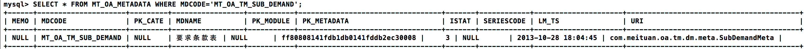
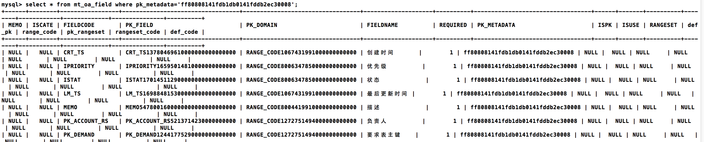

#Entity
##应用场景
* 提供元数据服务，管理表结构。
* 开发人员定义好表元数据（TableMeta）后，可直接通过系统前端，增加或修改表。

##基本原理
	利用MT_PF_ENTITY、MT_PF_FIELD，存储表元数据、字段元数据，管理表和字段间的关系。

##结构设计

####MT_PF_ENTITY
MT_PF_ENTITY保存所有表的元数据信息，业务加工->元数据服务查询的是该表。  
以MT_OA_TM_SUB_DEMAND表为例，它在MT_PF_ENTITY中的内容如下：
 
 
字段|名称|含义
---:|:---:|:---
PK_ENTITY|主键|
ENTITY_CODE|表编码|如MT_OA_TM_SUB_DEMAND
ENTITY_NAME|表名|如'要求条款表'
URI|资源路径|表的完整类名，如com.meituan.oa.tm.dm.meta.SubDemandMeta
MEMO|描述|为NULL
ISTAT|状态|0:编辑;3:正常;5:同步
PK_CATE|扩展分类主键|`什么意思???`

####MT_PF_FIELD
MT_PF_FIELD保存每个表的所有字段信息。  
以MT_OA_TM_SUB_DEMAND为例，根据其在MT_PF_ENTITY中的主键，查MT_PF_FIELD。
 

字段|名称|含义
---:|:---:|:---
PK_FIELD|主键|
PK_ENTITY|元数据主键|用于关联MT_PF_ENTITY表的PK_ENTITY
FIELDNAME|字段名称|如'状态'
FIELDCODE|字段编码|如'ISTAT'
PK_DOMAIN|类型|用于关联MT_PF_DS_RANGE表的PK_DS_RANGE
PK_RANGESET|数据集主键|用于关联MT_OA_DS表的PK_DS
RANGESET_CODE|值域|为NULL，项目中没用过
DEF_CODE|默认值（编码）|为NULL，项目中没用过
DEF_PK|默认值（主键）|为NULL，项目中没用过
ISPK|是否为主键|为NULL，项目中没用过
REQUIRED|是否为必须|为NULL，项目中没用过
ISCATE|是否为管理分类|为NULL，项目中没用过
##服务接口设计
####MetadataBizService常用接口
	/**
	 * 更改元数据的状态
	 * 
	 * @param pk_entity：元数据主键，stat：状态，0:编辑;3:正常;5:同步
	 * @return 
	 * @throws BuzException
	 */
	public void chgMetaStat(String pk_entity, Integer stat)
	
	/**
	  * 根据查询条件，返回表元数据列表
	  * @param condition 查询条件可设PK_ENTITY，PK_CATE，MD_UNIQUE，ISTAT
	  * @return 表元数据列表
	  */
	public List<GenericVO> fetchMetaListByCondition(GenericVO condition) 
	
	/**
	 * 添加,更新metadata基本信息
	 * 
	 * @param metadataVO，这个比较复杂，请看下面的举例
	 * @return 表元数据主键
	 * @throws BuzException
	 */
	public String saveMeta(GenericVO metadataVO) 

	/**
	 * 删除元数据，会同时删除关联的字段
	 * @param pk_entity 表元数据主键
	 * @throws BuzException
	 */
	public void deleteMeta(String pk_entity)
		
	/**
	  * 增加表字段
	  * @param fieldVO， 必须设置PK_ENTITY（表元数据），其他根据MT_PF_FIELD设置
	  * @return 字段主键
	  * @throws BuzException
	  */	
	public String saveField(GenericVO fieldVO) 
	
	/**
	  * 删除表字段
	  * @param pk_field， 字段主键
	  * @return 
	  * @throws BuzException
	  */	
	public void deleteField(String pk_field)  

##使用示范
####元数据服务
* 单击业务加工->元数据服务，搜索框可填写表名或表编码或为空，单击"查询"，查找MT_PF_ENTITY表中存储的表元数据。   
* 单击"导入"，过滤条件为表编码或表名或类名，包名前缀为搜索的包路径。   
* 单击"查询"，搜索com.meituan下所有继承自AbstractTableMeta的类，找到符合过滤条件的表，转换为表元数据，显示在查询结果中。选中需要导入的表，单击"导入"，此时更新表元数据和字段元数据，即MT_PF_ENTITY和MT_PF_FIELD中的信息，数据库中还未新增或修改该表。
* 此时导入的表状态为0(编辑)，需要选中该表，单击"同步"，修改数据库中相应的表结构，状态改为3。  
**注：目前新增，修改，删除，查看，配置按钮都没实现**	

####接口调用举例

	//构造表元数据
	GenericVO metadataVO = new GenericVO().set("ENTITY_CODE","MT_OA_MOCK").set("ENTITY_NAME", "假表").set("URI","testcase.pf.mds.meta.MockMeta").set("ISTAT", 0);
	
	//为表元数据增加一个字段
	GenericVO fieldVO = new GenericVO().set("FIELD_CODE","PK_ACCOUNT_CRT").set("FIELD_NAME","创建人").set("REQUIRED",1).set("PK_DOMAIN","RANGE_CODE1272751494000000000000");
	List<GenericVO> fieldList = new ArrayList<GenericVO>();
	fieldList.add(fieldVO);
	metadataVO.set("fields",fieldList);
	
	//保存表元数据
	String pk_entity = metadataService.saveMeta(metadataVO);

	//查询表编码为MT_OA_MOCK的表元数据
	GenericVO condition = new GenericVO().set("MD_UNIQUE", "MT_OA_MOCK");
	List<GenericVO> ret = metadataService.fetchMetaListByCondition(condition);				
	
	//构建字段
	GenericVO fieldvo = new GenericVO().set("FIELDCODE","f_1").set("FIELDNAME","瞎编");
			fieldvo.set("PK_DOMAIN", "pk_domain_t_code_1").set("PK_ENTITY",ret.get(0).$("PK_ENTITY"));
	
	//新增字段
	String pk_field = metadataService.saveField(fieldvo);
	
	//根据字段主键，删除该字段
	metadataService.deleteField(pk_field);

	//根据表主键，删除表元数据
	metadataService.deleteMeta(pk_entity);
##常见问题

**同步不成功，同步了但数据库中没有创建该表，也没有报错，坑爹吧**    
在导入和同步之前，你需要做两件事   
第一、到数据库中删除该表；   
第二、将mt_pf_entity和mt_pf_field中的相关记录全部删除。  
再同步就成功了。

