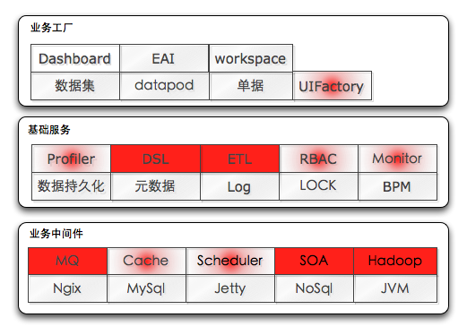

# pf
## 背景
怎么回答以下问题：

* 你到底在成天忙些啥？
	* 键盘测试？
	* 增删改查？
	* 还是诸如`服务=技术+平台+产品/业务模块`，利用技术，依托平台，实现业务，提升价值这种高端大气上档次的诠释？
* 想想看，你既往的工作经验中，把增删改查及各种校验代码去掉还剩多少耐人回味的(不要把api的调用熟练程度计算在内)？
* 会SSH，能帮你减少多少工作量？
* 为毛我们要费劲搞平台？
	* 隔离错误，提高整个系统的鲁棒性
	* 降低技术瓶颈，专注业务逻辑的实现
	* 降低开发成本
	* 减少重复代码量
	* 提高运维级的业务伸缩性
* 评级的时候，你咋显得你奔放的牛呢？

## 同行样本
江湖上，有这种想法的人很多，路子不尽相同，共同点还是有的

* 没有一个pf能解决所有问题，一定是基于特定的场景进行的抽象
* 每个pf，解决的最基本的问题都是相同的：降低开发成本，所以每个大佬或者有批量交付诉求的同行都会有个这玩意

		//TODO 而我们，要降低的是总体拥有成本(TCO)

### sap
名震江湖的企管软件的大佬，你能想得到的，支付能力最强的，中字头的，企业，基本上都用它
### jde
		//TODO
### uap@ufida
		//TODO
### 楼上@浪潮
		//TODO
### 普元
		//TODO
### EOS@金蝶
		//TODO
### 科诺
		//TODO
### R1@中软
		//TODO

## MT.IT.PF
由于我们还没发代表整个MT.RD，所以只能先叫这个名字了

### roadmap
* 完善各项服务，形成pf体系
* 引入soa体系，进行服务治理
* 构建mt.it.paas

### 服务结构图

	
	//纯红色背景代表还没动手；白里透红是代表已经启动但尚未完成

### 业务中间件层

#### MQ
* 是什么：消息队列(Message Queue)，进程间或线程间的一种`异步`通讯方式，无论是信息的发送方还是接收方都不用等待对方返回成功消息，继续执行后续的代码，大大的提高事物处理能力
* 干嘛用：业务逻辑中发个邮件/微信/大象，你不会想阻塞着等吧；基础信息变更你想第一时间让需求方知道吧
* 怎么用：参见docs/java/pf/cookbook/mq.md
* 当前状态：[v]none / [ ]技术选型 / [ ]技术储备 / [ ]可用

#### Cache
* 是什么：缓存，首先这是很高端大气上档次的法语词，也是一个很年轻的词(它只有不到50岁)。
* 干嘛用：在速度相差较大的两种软件/硬件之间，用来`协调两者数据传输速度差异`的结构
* 怎么用：参见docs/java/pf/cookbook/cache.md
* 当前状态：[ ]none / [ ]技术选型 / [v]技术储备 / [ ]可用

#### Scheduler
* 是什么：任务调度
* 干嘛用：你不想每天凌晨三点爬起来敲一行指令去跑任务吧(好吧，这活crontab也能干，但任务栈移植，任务互斥，集群，可用性保障啥的还是得上重一点的东西，别告诉我你没见过crontab莫名其妙的没在指定时间执行应该执行的task)；
* 怎么用：参见docs/java/pf/cookbook/schedule.md
* 当前状态：[ ]none / [ ]技术选型 / [v]技术储备 / [ ]可用

#### SOA
	//TODO 凸显重要性；分布式；基础性
* 是什么：soa是个很广泛，抽象的概念，这里我们特指分布式服务架构，包含服务注册，发现，治理，监控，安全
* 干嘛用：
	* 远程通讯：基于`长连接`的NIO框架抽象封装，基于接口方法的远程调用(多协议)
	* 集群容错：动态配置集群，软负载均衡(多策略)，失败容错，平滑并发负载伸缩(随时加减机器)
	* 自动发现：基于注册中心目录服务
	* paas的基石哦，亲
	* 怎么用：参考阿里的dubbo
* 当前状态：[ ]none / [ ]技术选型 / [v]技术储备 / [ ]可用

#### Hadoop
* 是什么：
* 干嘛用：
* 怎么用：
* 当前状态：[ ]none / [v]技术选型 / [ ]技术储备 / [ ]可用
#### Ngix
* 是什么：
* 干嘛用：
* 怎么用：
* 当前状态：[ ]none / [v]技术选型 / [ ]技术储备 / [ ]可用
#### jetty
* 是什么：
* 干嘛用：
* 怎么用：
* 当前状态：[ ]none / [v]技术选型 / [ ]技术储备 / [ ]可用
#### mysql
* 是什么：
* 干嘛用：
* 怎么用：
* 当前状态：[ ]none / [v]技术选型 / [ ]技术储备 / [ ]可用
#### nosql
* 是什么：
* 干嘛用：
* 怎么用：
* 当前状态：[ ]none / [v]技术选型 / [ ]技术储备 / [ ]可用
#### JVM
### 基础服务层
#### Profiler
* 是什么：
* 干嘛用：
* 怎么用：
* 当前状态：[ ]none / [v]技术选型 / [ ]技术储备 / [ ]可用

#### Monitor
* 是什么：
* 干嘛用：
* 怎么用：
* 当前状态：[ ]none / [v]技术选型 / [ ]技术储备 / [ ]可用

#### ETL
* 是什么：Extract(萃取)-Transform(转置)-Load(加载)的缩写
* 干嘛用：统计口径最终落实为代码可能是大段的sql外加大段的判断逻辑，你不希望领导看到的统计数据半天出不来吧，所以我们需要将业务数据，基础数据加工成简单的可以很快展示的数据结构，这个由繁到简的过程就被成为ETL
* 怎么用：
* 当前状态：[ ]none / [ ]技术选型 / [v]技术储备 / [ ]可用

#### RBAC
* 是什么：以角色为基础的访问控制(Role-based access control),通俗的说，就是权限管理系统，在这里，分为功能权限，数据权限
* 干嘛用：顾名思义访问控制和数据权限的实现(比如你能使用业务加工模块，其他的普通业务员就不行；你只能填写普通类型的报销单，而销售部的同事们却可以填写其他类型的报销单)
* 怎么用：docs/java/pf/cookbook/rbac.md
* 参考文献： [wiki](http://zh.wikipedia.org/wiki/%E4%BB%A5%E8%A7%92%E8%89%B2%E7%82%BA%E5%9F%BA%E7%A4%8E%E7%9A%84%E5%AD%98%E5%8F%96%E6%8E%A7%E5%88%B6)
* 当前状态：[ ]none / [v]技术选型 / [ ]技术储备 / [ ]可用

#### 数据持久化
* 是什么：data persistence,CRUD四件套中的C、U、D
* 干嘛用：用于存储数据，包含但不限于关系新数据库这种介质的存储(file,ldap,nosql)，采用统一的方式去操弄数据，忽略介质差异(类似spring data的立意)
* 怎么用：docs/java/pf/cookbook/dao.md
* 当前状态：[ ]none / [ ]技术选型 / [ ]技术储备 / [v]可用

#### 元数据
* 是什么：metadata，data about data，描述数据的数据。在我们的平台中目前主要用到的有实体元数据(bill model被归入模型一类，其实也可以叫单据元数据，同理dataset的model也可以叫数据集元数据)
* 干嘛用：
	* 不但在我们的平台中它作为基础/基石，其他的开发平台中也是如此;
	* 直白的说，有了数据结构，你就可以操作数据，并且增添了必要的灵活性
	* 诸如数据集，持久化等服务都是依赖该服务
	* 为运维阶段在线动态扩展实体属性提供支撑
* 怎么用：docs/java/pf/cookbook/metadata.md
* 当前状态：[ ]none / [v]技术选型 / [ ]技术储备 / [v]可用

#### LOG
* 是什么：日志，就是类似飞机上的黑匣子
* 干嘛用：
	* 如实的记录各种系统运行态信息
	* 提高代码的在线诊断能力(你不希望出了啥问题就要导数据下载日志吧)
	* 提供日志汇总，分析
* 怎么用：参见docs/java/pf/cookbook/log.md
* 当前状态：[ ]none / [v]技术选型 / [ ]技术储备 / [v]可用

#### BPM
* 是什么：业务流程管理(Business Process Management),基于工作流技术，体现企业管理与IT技术的结合
* 干嘛用：基于业务流程建模。支持业务流程的分析，建模，模拟，优化，协同，监控，往往是一个业务系统的核心
* 怎么用：
	* docs/java/pf/cookbook/bpm.md
	* docs/java/init/1st_flow.md
	* docs/java/common/activiti.md
* 当前状态：[ ]none / [ ]技术选型 / [ ]技术储备 / [v]可用

#### LOCK
* 是什么：锁(业务锁，分布锁)
* 干嘛用：保护资源的纯粹性，完备性(通俗的说，两个人同时启动一个单据的审批流程，只能有一个成功；或者两个人同时修改一个数据，后提交的人将会得到一个明确的提示当前数据不是最新的，无法保存)
* 怎么用：docs/java/pf/cookbook/lock.md
* 当前状态：[ ]none / [v]技术选型 / [ ]技术储备 / [v]可用

#### DSL
	4GL=Declarative+Textual+Graphical+Imperative
* 是什么：特定领域语言(domain specific language)
	* 涉及问题(内涵)：
		* 问题域(problem domain)/问题空间(problem space)
		* 语法(syntax)、语义(semantics)
		* 案例(case studies)、方法(methodology)、工具(tool support)
	* 分类
		* 外部DSL(External DSL)：先定义语法，然后通过parse或者code gen的方式把dsl转成一种通用语言代码，比如sql,xml配置文件，业务语言,
		* 内部DSL(Internal DSL)：利用编程语言自带的语法结构定义出来的DSL
* 干嘛用：求专不求精，解决特定问题(有别于c/java这样的4GL)
	* 各个平台中普遍存在的业务语言，不妨认为是dsl
	* sql是解决数据库操作的特种语言
	* 特定的说，不期望因为变更哪些繁复的校验就要重新部署一下代码(groovy)；不期望有共同特征的界面写千篇一律的代码(xul/uifactory)
* 怎么用：参见docs/java/pf/cookbook/cache.md
* 当前状态：[ ]none / [v]技术选型 / [ ]技术储备 / [ ]可用

### 业务工厂
#### Dataset
* 是什么：数据集，逻辑上的一个数据集合，可以是来自一个url，也可以是来自一个excel，一个sql
* 干嘛用：如果说持久化服务提供了忽略存储介质的差异操办数据，则数据集服务提供了忽略数据来源的使用数据(逻辑，应用场景层面有差异)
* 怎么用：docs/java/pf/cookbook/dataset.md
* 当前状态：[ ]none / [ ]技术选型 / [ ]技术储备 / [v]可用

#### Dashboard
* 是什么：数据导航，数据仪表盘
* 干嘛用：将当前登陆者感兴趣的统计口径，以图，表的方式展现在一个界面上，而无需知道其数据来源是哪个业务系统
* 怎么用：docs/java/pf/cookbook/dashboard.md
* 当前状态：[ ]none / [ ]技术选型 / [v]技术储备 / [ ]可用

#### DataPod
* 是什么：dashboard上用于展现一个数据集的单元被称之为datapod
* 干嘛用：用于按照指定的形式展示数据集(dataset)，也可以理解成数据集的显示模型
* 怎么用：docs/java/pf/cookbook/dashboard.md
* 当前状态：[ ]none / [v]技术选型 / [ ]技术储备 / [v]可用

#### Workspace
* 是什么：工作区，登陆后，看到的界面
* 干嘛用：众口难调，每个人想要的workspace风格可能是不太一样的，但可能最终用到的数据都是一样的，通过配置，允许用户自己选择，乃至一定程度上的自定义workspace，提高易用性
* 怎么用：
* 当前状态：[ ]none / [ ]技术选型 / [v]技术储备 / [ ]可用

#### EAI
* 是什么：企业应用集成(enterprise application integration)
* 干嘛用：异构应用系统集成的一种方法，通过建立底层结构，实现系统间的数据共享与交换
* 怎么用：docs/java/pf/cookbook/eai.md
* 当前状态：[ ]none / [v]技术选型 / [ ]技术储备 / [v]可用

#### bill
* 是什么：单据引擎，用类似xul的方式，允许用户在开发、运维阶段直接定义目标表单，并提高基于该表单的CRUD
* 干嘛用：
	* 简化功能节点开发(你不想同类型的功能节点写上个几十次吧)
	* 作为工作项的载体，与bpm整合
	* 作为ui-factory的单元
* 怎么用：docs/java/pf/cookbook/bill.md

* 当前状态：[ ]none / [ ]技术选型 / [ ]技术储备 / [v]可用

