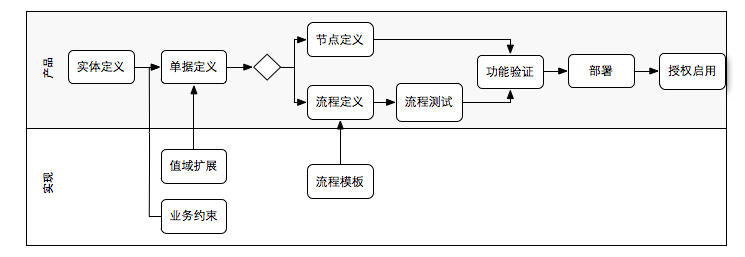

#业务工厂：标准工作流程
	//不是流程引擎的那个workflow，而是编程的过程描述
## 适用场景

一个典型的功能节点的开发过程，大致如下
	
			
	//TODO 插入一个图
## 实体定义
产品/设计根据需要定义实体，及关系(relationship)，具体方法如下

* [x] 方案1：利用工具：打开业务加工/元数据管理

		//预期提供，CRUD；现有table meta导入；
		//TODO：增加/删除/修改/查询/查看/导入/同步(实体结构，元数据记录)
		//TIP:主键必须唯一，确保反复操作时主键一致(ENTITY_CODE.FIELD_CODE)

* [v]方案2：编码
	* 直接生成table meta
	* 利用dsa服务进行同步

			//需要注意的是如果有必要，预留自定义项
	
## 值域扩展(可选)
### [v] 数据集定义
	//TODO 利用数据集管理；datapod管理进行
### [v] 显示模型(datapod)定义	
## 单据定义
* [x] 方案1：单据管理

		//提供功能：创建向导；修改；删除；预览；导入；导出；
		//向导式创建：选择主表，子集，填写bill_code就创建出一个来
* [v] 方案2：手写bill model文件

		//提供参考范本；及文档
## 业务约束(含单据)
## 功能类型
### 非流程
#### [x] 节点注册
		//功能节点注册：节点分类：是否受权限控制；单据类型还是自定义类型
		//单据类型可以指定类型:grid-bill;treegrid-bill;tree-bill;(可以指定controller.js)
* 定义节点类型
* 参数配置

### 流程
		//总得来段文字描述吧
#### 流程注册
	// - 流程类型必须要指明是否受权限控制
#### 流程定义
需要指明可以根据流程模板来设定(wizard模式：提供集中流程模板，设定一下参数，自动生成bpmn文件)
		
	//可以支持导出bpmn文件
	//利用freemarker实现，主要是为了产品方便，避免重复的设置
	//designer可以直接提供默认值的，比如扩展后的user task(设定好条件；或者定义业务函数)
#### [v] 流程部署
	//必须指明是在线部署
	//需要将现有的数据迁移一下
#### 流程测试
	//流程测试工具
#### 流程启用

	//流程注册那里，直接启用，如果不受控制，则人人可见了

## 部署(成果移植、导出)
	// 指定节点或者流程进行导出(利用eai service)
## 授权启用
